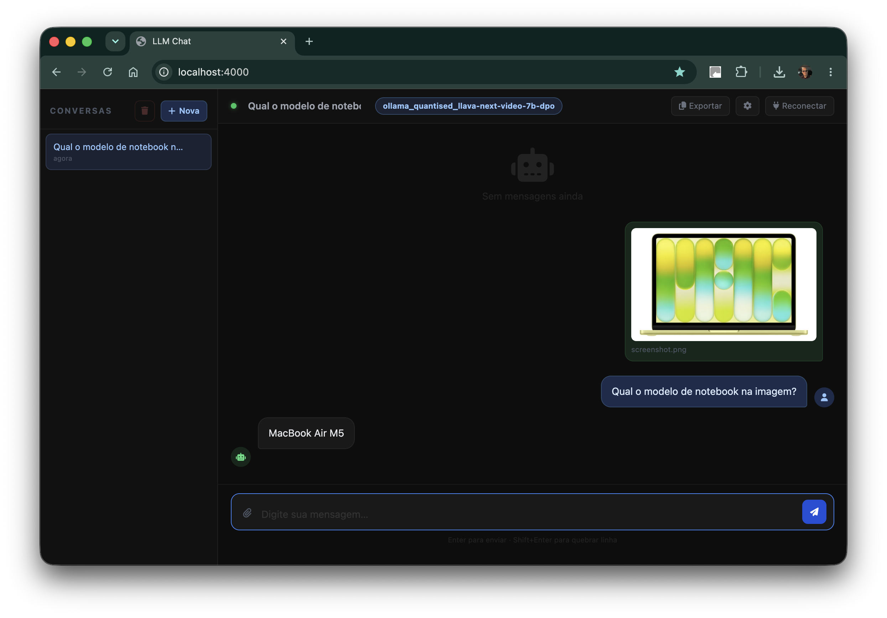

# llm-chat

Interface web **self-hosted** para conversar com modelos de linguagem locais. Conecta a qualquer backend compatível com a API OpenAI — Ollama, LM Studio, llama.cpp — sem enviar dados para nenhum servidor externo.



---

## Por que usar?

- **Privacidade total** — suas conversas ficam na sua máquina
- **Sem custo por token** — você paga só a energia da GPU
- **Sem limites de uso** — sem rate limit, sem fila, sem assinatura
- **Multimodal** — imagens, PDFs e documentos de texto como contexto
- **Markdown renderizado** — código, tabelas e formatação exibidos corretamente

---

## Demonstração rápida

```
Navegador (qualquer dispositivo na rede)
  │  HTTP / SSE
  ▼
llm-chat  ← Node.js :4000  (Zima OS, NAS, Raspberry Pi, qualquer servidor)
  │  proxy /llm/*
  ▼
LLM local ← Ollama / LM Studio / llama.cpp  (PC com GPU)
```

---

## Funcionalidades

### Conversas
- Múltiplas conversas com persistência em JSON (sem banco de dados)
- Renomeação inline, exclusão e auto-título na primeira mensagem
- Histórico completo mantido entre sessões

### Modelos
- **Detecção automática** dos modelos carregados via `/v1/models`
- **Troca automática de modelo** ao anexar imagem: detecta modelos de visão (`llava`, `moondream`, `bakllava`, etc.) e troca sozinho
- Configurações por conversa: modelo, temperatura, max tokens, system prompt

### Arquivos e imagens
- Upload de imagens (JPG, PNG, GIF, WebP) com preview na thread
- Upload de PDFs — texto extraído automaticamente com `pdf-parse`
- Upload de `.txt`, `.md`, `.json`, `.sql` e outros arquivos de texto
- **Cmd+V / Ctrl+V** no campo de texto: cola screenshot diretamente
- Preview do anexo aparece na thread como bolha, não acima do input

### Interface
- Respostas do modelo renderizadas em **Markdown** (código, tabelas, listas, títulos)
- Indicador animado "Pensando…" / "Analisando imagem…" enquanto o modelo processa
- Barra de progresso na parte superior durante a geração
- Botão **Copiar** em cada resposta (copia o markdown cru)
- Botão **Exportar** — copia toda a conversa como texto limpo para colar no WhatsApp, e-mail etc.
- Dark mode

### Memória global
- Campo de memória persistido em `data/memory.md`
- Injetado automaticamente no system prompt de **toda** conversa
- Ideal para nome, preferências, contexto pessoal

### Configurações (modal ⚙)
- Modelo, temperatura, max tokens, system prompt
- Memória global
- Tudo em um único modal, sidebar limpa com só a lista de conversas

---

## Requisitos de hardware

O llm-chat em si é leve — roda em qualquer máquina com Node.js. O que exige GPU é o **servidor LLM**.

### GPU recomendada por tamanho de modelo

| Modelo | VRAM mínima | Exemplos |
|---|---|---|
| 1–4b parâmetros | 4 GB | Gemma 4b, Phi-3 mini |
| 7–8b parâmetros | 8 GB | LLaVA 7b, Llama 3.1 8b |
| 13–14b parâmetros | 16 GB | Llama 2 13b, CodeLlama 13b |
| 70b parâmetros | 48 GB+ | Llama 3.3 70b |

> **Nota:** Modelos quantizados (Q4, Q5, Q8) usam significativamente menos VRAM. Um Llama 8b Q4 cabe em 6 GB.

### Testado com
- **NVIDIA RTX série 30/40/50** (drivers CUDA)
- LM Studio como servidor local

---

## Instalação

### 1. Configure o servidor LLM

Instale o [LM Studio](https://lmstudio.ai), baixe um modelo e ative o servidor local:

```
LM Studio → Developer → Start Server
```

O servidor sobe em `http://localhost:1234` por padrão.

Para usar visão (imagens), carregue um modelo compatível como `llava-v1.6`, `moondream2` ou `llava-next`.

### 2. Configure o llm-chat

```bash
git clone https://github.com/marcelosicuro/llm-chat.git
cd llm-chat
cp .env.example .env
```

Edite `.env`:

```env
PORT=4000
LLM_URL=http://IP_DO_SEU_PC:1234   # IP e porta do LM Studio / Ollama
```

### 3. Execute

**Sem Docker (desenvolvimento):**

```bash
npm install
npm run dev    # auto-reload com nodemon
```

Acesse `http://localhost:4000`.

**Com Docker Compose (produção / servidor doméstico):**

```bash
docker compose up -d --build
```

As conversas e a memória ficam em `./data/` fora do container.

---

## Deploy em servidor doméstico (Zima OS / NAS / Raspberry Pi)

```bash
# No servidor
git clone https://github.com/marcelosicuro/llm-chat.git /DATA/llm-chat
cd /DATA/llm-chat

# Edite LLM_URL no docker-compose.yml apontando para o PC com GPU
docker compose up -d --build
```

Acesse pelo IP local do servidor: `http://192.168.X.X:4000`

**Atualizar depois:**

```bash
git pull && docker compose up -d --build
```

---

## Stack

| Camada | Tecnologia |
|---|---|
| Runtime | Node.js 20 |
| Framework | Express 4 |
| Upload | Multer |
| PDF | pdf-parse v1 |
| Frontend | HTML5 + Bootstrap 5.3 + Vanilla JS |
| Markdown | marked.js |
| Deploy | Docker + docker-compose |
| Persistência | JSON em disco (`data/`) |

---

## Estrutura do projeto

```
llm-chat/
├── server.js            # Express: API REST + proxy SSE + upload
├── public/
│   └── index.html       # SPA completa — UI, estado, fetch, markdown
├── data/                # Criado automaticamente
│   ├── conversations.json
│   └── memory.md
├── Dockerfile
├── docker-compose.yml
└── .env.example
```

---

## API

| Método | Rota | Descrição |
|---|---|---|
| `GET` | `/conversations` | Lista conversas (sem mensagens) |
| `POST` | `/conversations` | Cria conversa |
| `GET` | `/conversations/:id` | Conversa completa com mensagens |
| `PATCH` | `/conversations/:id` | Atualiza título, mensagens, settings, contexto |
| `DELETE` | `/conversations/:id` | Remove conversa |
| `POST` | `/upload-context` | Upload de arquivo (texto, PDF ou imagem) |
| `GET` | `/memory` | Lê `data/memory.md` |
| `PATCH` | `/memory` | Salva `data/memory.md` |
| `ALL` | `/llm/*` | Proxy transparente para `LLM_URL` (preserva SSE) |

---

## Backends compatíveis

Qualquer servidor com API compatível com OpenAI funciona:

| Backend | `LLM_URL` |
|---|---|
| [LM Studio](https://lmstudio.ai) | `http://localhost:1234` |
| [Ollama](https://ollama.com) | `http://localhost:11434` |
| [llama.cpp server](https://github.com/ggml-org/llama.cpp) | `http://localhost:8080` |

---

## Limitações conhecidas

- Conversas são armazenadas em JSON simples — não escala para milhares de conversas
- Imagens não são persistidas no histórico (apenas na sessão ativa)
- Sem autenticação — use apenas em rede local confiável
- A qualidade das respostas depende do modelo escolhido

---

## Licença

MIT — use, modifique e distribua à vontade.

---

*Construído com Node.js, muito café e uma RTX que não dorme.*
